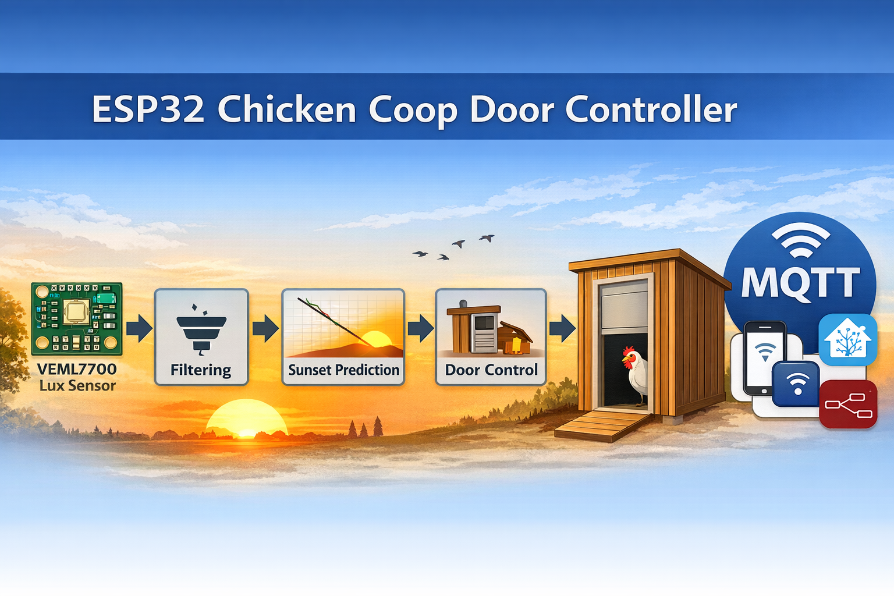

<p align="center">
  
</p>

<h1 align="center">🐔 ESP32 Hühnerklappe</h1>
<p align="center">
  Lux-Automatik &nbsp;•&nbsp; Sonnenuntergangs-Prognose &nbsp;•&nbsp; MQTT &nbsp;•&nbsp; Web-Interface &nbsp;•&nbsp; OTA-Updates
</p>

<p align="center">
  
  
  
  
  
</p>

---

Ein **ESP32-basierter intelligenter Controller für automatische Hühnerstalltüren**, der Umgebungslicht misst, Sonnenuntergänge vorhersagt und mehrere Sicherheits-Fallbacks enthält.

Der Controller verwendet einen **VEML7700 Lux-Sensor** mit Medianfilter, exponentieller Glättung und Trend-Erkennung, um den optimalen Zeitpunkt zum Öffnen und Schließen der Tür zu bestimmen. Entwickelt für **reale Wetterbedingungen**: Wolken, Regen, Schnee, Sensorrauschen.

---

## ✨ Funktionen

| Funktion | Beschreibung |
|---|---|
| 🌅 **Lux-Automatik** | Öffnen/Schließen anhand Umgebungshelligkeit (VEML7700) |
| 📉 **Sonnenuntergangs-Prognose** | Schließzeitpunkt aus Lux-Änderungsrate berechnet |
| 💡 **Vorlicht** | Stalllicht geht vor dem Schließen an – Hühner kommen rein |
| 🌥 **Wolken-Erkennung** | Verhindert Fehltrigger durch Wolken oder kurze Aufhellung |
| ⏰ **Zeit-Fallback** | Wechselt automatisch auf Zeitsteuerung bei Sensorausfall |
| 🛑 **Endschalter** | Optionale Hardware-Positionserkennung |
| ⚡ **Blockade-Erkennung** | ACS712 Stromsensor stoppt und reversiert bei Motorblockade |
| 📡 **MQTT** | Vollständige Home Assistant / Node-RED Integration |
| 🌐 **Web-Interface** | Browser-Steuerung, als PWA installierbar |
| 🔧 **OTA-Updates** | Firmware-Update kabellos über den Browser |
| 📜 **Logbuch** | Ereignisprotokoll persistent im EEPROM gespeichert |
| 🔴 **RGB-Beleuchtung** | PWM-gesteuerter LED-Strip über N-Kanal MOSFETs |

---

## 🌅 Lux-basierte Automatik

Jeder Messwert durchläuft eine mehrstufige Verarbeitungs-Pipeline:

1. Rohwert-Messung mit automatischer Verstärkungs-Umschaltung (VEML7700)
2. Medianfilter (Puffergröße 5) – filtert Einzelausreißer und Spitzen
3. Exponentielles Glätten (EMA) – `lux = lux × 0,8 + raw × 0,2`
4. Lux-Trend-Berechnung (Änderungsrate alle 30 s)
5. Prognose-Logik für Sonnenuntergang

Damit werden Sonnenauf- und -untergang **zuverlässig erkannt**, auch bei bewölktem Himmel.

---

## 📉 Sonnenuntergangs-Prognose

Die Firmware berechnet die **Lux-Änderungsrate**, um vorherzusagen, wann die Schließschwelle erreicht wird:

```
minutesToThresh = (lux - threshold) / luxRate
```

Das System bereitet das Schließen **vor** dem eigentlichen Schwellwert vor – für präziseres Timing und ruhigeres Dämmerungsverhalten.

---

## 🌥 Wolken-Erkennung

Wird es zwischendurch wieder heller, wird die Schließ-Prognose automatisch abgebrochen:

```
lux > closeThreshold + PRECLOSE_ABORT_MARGIN_LX
```

Verhindert vorzeitiges Schließen durch vorbeiziehende Wolken.

---

## 🛑 Sicherheitsfunktionen

**Endschalter** — Erkennen „Tür vollständig offen" und „Tür vollständig geschlossen". Schützen den Motor vor Überlastung. Im Web-Interface aktivierbar/deaktivierbar.

**Nacht-Sperre** — Sobald die Tür nachts geschlossen ist, wird erneutes Öffnen blockiert bis zum Morgenfenster. Schützt vor Fehltriggern durch Außenbeleuchtung oder Autoscheinwerfer.

**Glitch-Filter** — Kurze Helligkeitsspitzen durch Blitze, Autoscheinwerfer oder Kamerablitze werden per Lux-Hysterese und Hold-Timer ignoriert.

**Motorblockade-Erkennung** — ACS712-Stromsensor erkennt Blockaden. Bei Blockade fährt der Motor kurz zurück (Reverse-After-Blockage).

---

## 🔄 Fallback-Systeme

Falls der VEML7700 ausfällt, wechselt das System automatisch auf **zeitbasierte Steuerung**.

Mögliche Auslöser:
- Sensorfehler / Sensor nicht gefunden
- Ungültige Lux-Werte
- I²C-Kommunikationsfehler
- Sensor-Timeout

Der I²C-Bus wird bei Blockade automatisch zurückgesetzt (9 Clock-Pulse + STOP-Bedingung), gefolgt von Sensor-Neuinitialisierung.

---

## 🛒 Benötigte Bauteile

### Pflichtbauteile

| Bauteil | Beschreibung | Anzahl |
|---|---|---|
| **ESP32 DevKit v1** | Mikrocontroller (WROOM-32) | 1 |
| **L298N** | Motorsteuermodul (Dual H-Brücke) | 1 |
| **Gleichstrommotor 12 V** | Getriebemotor, passend zur Klappe | 1 |
| **VEML7700** | Lichtsensor-Breakout (I²C, 3,3 V) | 1 |
| **DS3231** | Echtzeituhr-Modul (I²C, mit CR2032) | 1 |
| **Relaismodul 5 V, 2-Kanal** | LOW-aktiv | 1 |
| **Netzteil 12 V / min. 2 A** | Für Motor und Lampen | 1 |
| **Netzteil 5 V** | Für ESP32 (USB oder Step-Down) | 1 |
| **Taster NO** | Kurzhubtaster, normalerweise offen | 3 |
| **Jumperkabel** | Stecker-Buchse, verschiedene Längen | ~30 |

### Optionale Bauteile

| Bauteil | Beschreibung | Anzahl |
|---|---|---|
| **IRLZ44N** | N-Kanal MOSFET für RGB LED-Strip | 3 |
| **Widerstand 470 Ω** | Gate-Vorwiderstand für MOSFET | 3 |
| **RGB LED-Strip 12 V** | Getrennte R/G/B-Kanäle (kein WS2812!) | nach Bedarf |
| **ACS712 (5 A oder 20 A)** | Stromsensor für Blockade-Erkennung | 1 |
| **Endschalter / Mikroschalter** | Für genaue Positionserkennung | 2 |
| **Gehäuse IP65** | Wetterfester Anschlusskasten | 1 |

> 💡 Ein 12 V → 5 V Step-Down-Modul (z. B. LM2596) spart ein zweites Netzteil.

---

## 📍 Pin-Übersicht ESP32

| GPIO | Funktion | Bauteil | Hinweis |
|---|---|---|---|
| **25** | Motor IN1 | L298N IN1 | Richtungssteuerung |
| **26** | Motor IN2 | L298N IN2 | Richtungssteuerung |
| **27** | Motor ENA (PWM) | L298N ENA | Geschwindigkeit via LEDC |
| **18** | Locklicht-Relais | Relais Kanal 1 | LOW = AN |
| **19** | Stalllicht-Relais | Relais Kanal 2 | LOW = AN |
| **33** | Taster Tür | Taster 1 | INPUT_PULLUP |
| **32** | Taster Stalllicht | Taster 2 | INPUT_PULLUP |
| **35** | Taster Rotlicht | Taster 3 | INPUT_PULLUP, **nur Eingang!** |
| **34** | ACS712 analog | Stromsensor | INPUT only |
| **21** | I²C SDA | VEML7700 + DS3231 | gemeinsamer Bus |
| **22** | I²C SCL | VEML7700 + DS3231 | gemeinsamer Bus |
| **14** | Endschalter AUF | Mikroschalter | LOW = Position erreicht |
| **12** | Endschalter ZU | Mikroschalter | LOW = Position erreicht |
| **4** | RGB Rot (PWM) | MOSFET Gate | via 470 Ω |
| **16** | RGB Grün (PWM) | MOSFET Gate | via 470 Ω |
| **17** | RGB Blau (PWM) | MOSFET Gate | via 470 Ω |

---

## 🔌 Verkabelung

> ⚠️ Vor jeder Verkabelungsarbeit Strom trennen.  
> ⚠️ Der ESP32 verträgt maximal **3,3 V** an den GPIO-Pins – niemals direkt 5 V oder 12 V anlegen!

### Motor (L298N)
```
ESP32 GPIO 25 ──── L298N IN1
ESP32 GPIO 26 ──── L298N IN2
ESP32 GPIO 27 ──── L298N ENA      ← ENA-Jumper entfernen!
L298N OUT1    ──── Motor (+)
L298N OUT2    ──── Motor (−)
12 V          ──── L298N VSS
GND           ──── L298N GND
```

### I²C-Bus (VEML7700 + DS3231)
```
ESP32 GPIO 21 (SDA) ──┬── VEML7700 SDA
                      └── DS3231 SDA
ESP32 GPIO 22 (SCL) ──┬── VEML7700 SCL
                      └── DS3231 SCL
ESP32 3,3 V ──────────── VEML7700 VCC   ← unbedingt 3,3 V, nicht 5 V!
GND ──────────────────┬── VEML7700 GND
                      └── DS3231 GND
```

### Relais
```
ESP32 GPIO 18 ──── Relais IN1   (Locklicht,  LOW = AN)
ESP32 GPIO 19 ──── Relais IN2   (Stalllicht, LOW = AN)
Relais NO     ──── Lampe (+)
Relais COM    ──── 12 V (+)
```

### Taster
```
GPIO 33 ──── Taster Tür        + GND
GPIO 32 ──── Taster Stalllicht + GND
GPIO 35 ──── Taster Rotlicht   + GND
```

### RGB LED-Strip via MOSFET
```
GPIO  4 ──[470 Ω]── Gate IRLZ44N Rot
GPIO 16 ──[470 Ω]── Gate IRLZ44N Grün
GPIO 17 ──[470 Ω]── Gate IRLZ44N Blau

MOSFET Drain  ──── LED-Strip Kanal (12 V)
MOSFET Source ──── GND
LED-Strip V+  ──── 12 V
```

### Endschalter (optional)
```
GPIO 14 ──── Endschalter AUF + GND
GPIO 12 ──── Endschalter ZU  + GND
```

---

## 💻 Software-Installation

### Voraussetzungen

- [Visual Studio Code](https://code.visualstudio.com/)
- [PlatformIO Extension](https://platformio.org/install/ide?install=vscode) in VS Code
- USB-Treiber: [CP2102](https://www.silabs.com/developers/usb-to-uart-bridge-vcp-drivers) oder [CH340](https://www.wch-ic.com/downloads/CH341SER_ZIP.html)

### Schritt 1 – Repository klonen

```bash
git clone https://github.com/Huehnerfluesterer/ESP-Huehnerklappe.git
```

### Schritt 2 – WLAN-Zugangsdaten eintragen

Datei `src/config.h` öffnen und anpassen:

```cpp
#define WIFI_SSID     "Dein_WLAN_Name"
#define WIFI_PASSWORD "Dein_WLAN_Passwort"
```

> ⚠️ Diese Datei in `.gitignore` eintragen – sie enthält geheime Zugangsdaten:
> ```
> src/config.h
> ```

### Schritt 3 – Projekt öffnen & flashen

1. VS Code → **Datei → Ordner öffnen** → Projektordner wählen
2. PlatformIO erkennt das Projekt automatisch und lädt alle Bibliotheken
3. ESP32 per USB anschließen
4. Unten auf **→ Upload** klicken (oder `PlatformIO: Upload`)

Erfolgreiche Ausgabe im Terminal:
```
[SUCCESS] Took xx.xx seconds
```

Seriellen Monitor öffnen (Stecker-Symbol, 115 200 Baud):
```
🐔 Hühnerklappe – FW 1.0.15
✅ RTC per NTP synchronisiert
🚀 Hühnerklappe gestartet – FW 1.0.15
```

### Schritt 4 – IP-Adresse herausfinden

Die IP steht im seriellen Monitor oder im Router unter den verbundenen Geräten (`Huehnerklappe-ESP32`). Dann im Browser öffnen:

```
http://192.168.x.x
```

---

## 🌐 Web-Interface

Erreichbar über den Browser im Heimnetz. Als **PWA** auf dem Smartphone installierbar (Browser-Menü → „Zum Startbildschirm hinzufügen").

| Route | Funktion |
|---|---|
| `/` | Dashboard: Status, Türsteuerung, Licht |
| `/settings` | Automatik-Modus, Zeiten, Lux-Schwellwerte |
| `/advanced` | Erweiterte Einstellungen, Endschalter |
| `/mqtt` | MQTT-Konfiguration & Test |
| `/learn` | Motorpositionen einlernen |
| `/log` | Ereignis-Logbuch |
| `/systemtest` | Hardware-Selbsttest (RTC, VEML, WLAN, Motor) |
| `/fw` | OTA Firmware-Update |
| `/calibration` | Motor-Kalibrierung |

---

## 📡 MQTT

Konfiguration unter `/mqtt` im Web-Interface. Vollständige Doku: [docs/mqtt.de.md](docs/mqtt.de.md)

| Topic | Richtung | Inhalt |
|---|---|---|
| `{base}/available` | ESP32 → Broker | `online` / `offline` |
| `{base}/status` | ESP32 → Broker | JSON Gerätestatus |
| `{base}/settings` | ESP32 → Broker | Einstellungen (retained) |
| `{base}/log` | ESP32 → Broker | Logbuch-Einträge |
| `{base}/cmd` | Broker → ESP32 | Steuerbefehle (JSON) |

Kompatibel mit **Home Assistant**, **Node-RED** und anderen Smart-Home-Systemen.

---

## ✅ Erstinbetriebnahme-Checkliste

- [ ] Hardware verkabelt und alle Verbindungen geprüft
- [ ] `src/config.h` mit WLAN-Daten befüllt, in `.gitignore` eingetragen
- [ ] Firmware geflasht – serieller Monitor zeigt `🚀 Hühnerklappe gestartet`
- [ ] IP-Adresse gefunden, Web-Interface im Browser erreichbar
- [ ] Systemtest unter `/systemtest` durchgeführt (RTC ✅, VEML ✅, WLAN ✅)
- [ ] Lern-Modus unter `/learn` abgeschlossen (Motorpositionen gespeichert)
- [ ] Betriebsmodus gewählt (`lux` empfohlen) und gespeichert
- [ ] Lux-Schwellwerte für den Standort angepasst
- [ ] Testlauf: Tür manuell öffnen und schließen
- [ ] Optional: MQTT konfiguriert und Verbindung getestet

---

## 🔍 Fehlerbehebung

**ESP32 wird nicht als COM-Port erkannt**  
→ USB-Treiber installieren (CP2102 oder CH340). Anderes USB-Kabel probieren (manche sind nur Ladekabel ohne Datenleitungen).

**Upload schlägt fehl: „Connecting…____"**  
→ `BOOT`-Taste gedrückt halten während Upload startet, dann loslassen.

**VEML7700 nicht gefunden**  
→ SDA = GPIO 21, SCL = GPIO 22 prüfen. Spannung am VCC muss **3,3 V** sein, nicht 5 V.

**Motor dreht nicht**  
→ ENA-Jumper am L298N entfernt? L298N mit 12 V versorgt? GPIO 27 verbunden?

**Tür öffnet/schließt nicht automatisch**  
→ Lux-Schwellwerte unter `/settings` anpassen. Aktuellen Lux-Wert im Systemtest ablesen.

**Build-Fehler auf Windows: `WiFi.h not found`**  
→ Datei `src/WiFi.cpp` löschen falls vorhanden (Namenskonflikt mit Framework-Header).

---

## 📁 Projektstruktur

```
ESP-Huehnerklappe/
├── platformio.ini          # Build-Konfiguration & Bibliotheken
├── docs/
│   ├── HW.de.md            # Hardware & Verkabelung (Detail)
│   ├── installation.de.md  # Installationsanleitung
│   ├── mqtt.de.md          # MQTT-Dokumentation
│   └── architecture.de.md  # System-Architektur
└── src/
    ├── config.h            # ⚠️ WLAN-Zugangsdaten (.gitignore!)
    ├── pins.h              # GPIO-Pin-Definitionen
    ├── types.h             # Enums & Structs
    ├── main.cpp            # Setup, Loop, WebServer-Routen, OTA
    ├── motor.cpp/.h        # L298N-Motorsteuerung (LEDC-PWM)
    ├── door.cpp/.h         # Türzustand & Taster
    ├── lux.cpp/.h          # VEML7700: Sensor, Filter, Trend, Recovery
    ├── light.cpp/.h        # Licht-Automatik & RGB-PWM
    ├── logic.cpp/.h        # Automatik-Entscheidungslogik
    ├── mqtt.cpp/.h         # MQTT-Client & Topics
    ├── wlan.cpp/.h         # WLAN-Verbindung & Watchdog
    ├── storage.cpp/.h      # EEPROM-Persistenz
    ├── logger.cpp/.h       # Ringpuffer-Logbuch
    ├── system.cpp/.h       # System-Health & Uptime
    ├── icons.h             # PWA-Icons (PROGMEM)
    └── web/
        ├── web_root.cpp    # Dashboard
        ├── web_pages.cpp   # Systemtest, Log, OTA
        ├── web_settings.cpp# Einstellungen & MQTT-Seite
        └── web_helpers.cpp # HTML-Bausteine & CSS
```

---

## 📜 Lizenz

MIT License – Freie Nutzung, Veränderung und Weitergabe erlaubt.

---

## 🤝 Mitarbeit

Pull Requests und Verbesserungsvorschläge sind willkommen.
