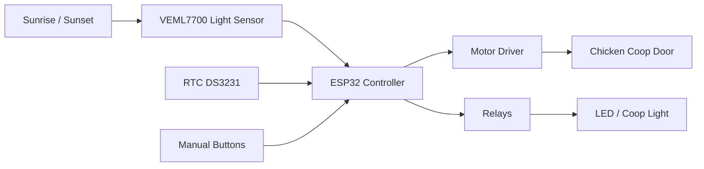
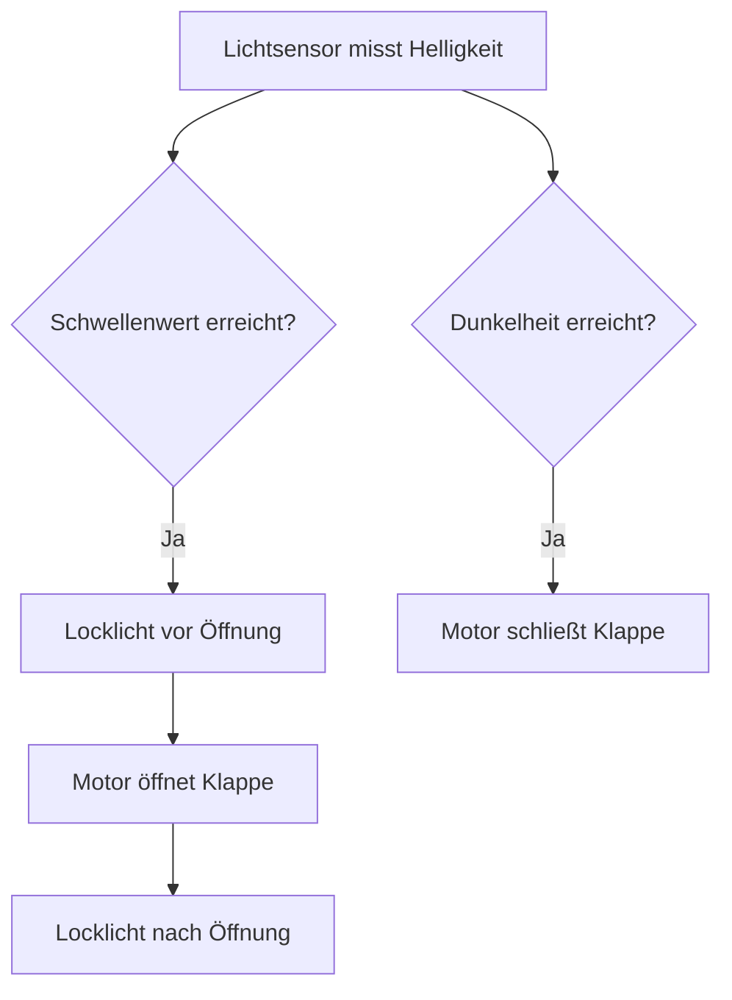
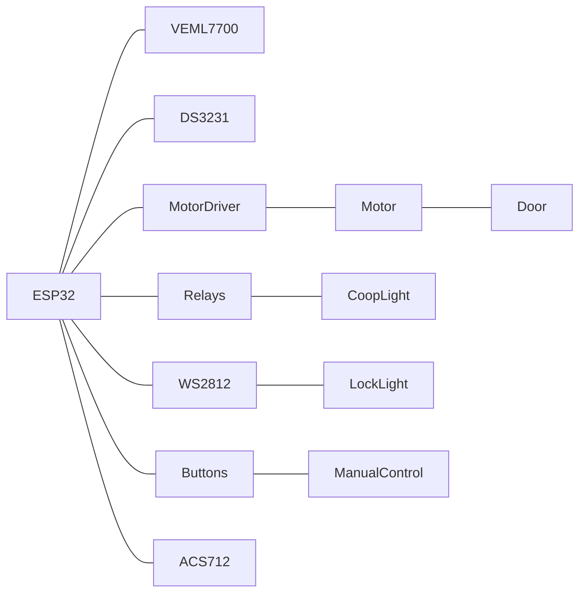

## ESP32 Chicken Coop Door Controller 🐔

Automatische Hühnerstall-Klappensteuerung mit **ESP32**, **Lichtsensor**, **RTC**, **Motorsteuerung**, **Locklicht** und **Webinterface**.

Das System öffnet und schließt die Stallklappe automatisch abhängig von der Helligkeit.

---

## 📷 Systemübersicht



---

## 🧠 Funktionsprinzip



---

## 🔌 Hardwareübersicht

## Hauptkomponenten

| Bauteil              | Beschreibung      |
| -------------------- | ----------------- |
| ESP32 DevKit         | Hauptcontroller   |
| VEML7700             | Helligkeitssensor |
| DS3231               | Echtzeituhr       |
| L298N / Motor Driver | Motorsteuerung    |
| ACS712               | Stromsensor       |
| WS2812               | Locklicht         |
| Relais               | Stallbeleuchtung  |
| Endschalter          | Türposition       |

---

## ⚡ Pinbelegung

| ESP32 Pin | Funktion                |
| --------- | ----------------------- |
| GPIO4     | WS2812 LED              |
| GPIO12    | Endschalter geschlossen |
| GPIO14    | Endschalter offen       |
| GPIO18    | Locklicht Relais        |
| GPIO19    | Stalllicht Relais       |
| GPIO21    | I²C SDA                 |
| GPIO22    | I²C SCL                 |
| GPIO25    | Motor IN1               |
| GPIO26    | Motor IN2               |
| GPIO27    | Motor PWM               |
| GPIO32    | Stalllicht Taster       |
| GPIO33    | Tür Taster              |
| GPIO34    | Stromsensor             |

---

## 🔧 Verdrahtungsdiagramm



---

## 🔌 I²C Bus

Der I²C Bus wird von mehreren Komponenten gemeinsam genutzt.

```
ESP32 GPIO21 (SDA) ───── VEML7700 SDA
                       └──── DS3231 SDA

ESP32 GPIO22 (SCL) ───── VEML7700 SCL
                       └──── DS3231 SCL
```

---

## 🚪 Endschalter

Endschalter arbeiten mit **INPUT_PULLUP**.

Logik:

```
LOW  = Endschalter aktiv
HIGH = Endschalter nicht aktiv
```

Verdrahtung:

```
GPIO14 ─── Endschalter offen ─── GND
GPIO12 ─── Endschalter geschlossen ─── GND
```

---

## 🔘 Taster

Türsteuerung:

```
GPIO33 ─── Taster ─── GND
```

Stalllicht:

```
GPIO32 ─── Taster ─── GND
```

---

## 💡 Locklicht (WS2812)

```
GPIO4 ─── 330Ω ─── DIN WS2812
5V ─────────────── VCC
GND ────────────── GND
```

Empfohlen:

* 330Ω Datenwiderstand
* 1000µF Kondensator zwischen 5V und GND

---

## ⚙️ Motorsteuerung

Beispiel mit **L298N**

```
ESP32 GPIO25 → IN1
ESP32 GPIO26 → IN2
ESP32 GPIO27 → ENA

Motor → OUT1 / OUT2
12V → Motorversorgung
```

---

## 🔒 Sicherheit

Das System enthält mehrere Sicherheitsfunktionen:

* Endschalter stoppen den Motor
* Stromsensor erkennt Blockierungen
* Zeitlimit verhindert Dauerlauf
* Manuelle Steuerung jederzeit möglich

---

## 🌐 Webinterface

Über das Webinterface können eingestellt werden:

* Öffnungsschwelle
* Schließschwelle
* Locklichtdauer
* Stalllicht
* manuelle Türsteuerung

---

## 📦 Projektstruktur

Empfohlene GitHub Struktur:

```
/firmware
/docs
/images
/hardware
README.md
```

---

## 📜 Lizenz

MIT License
