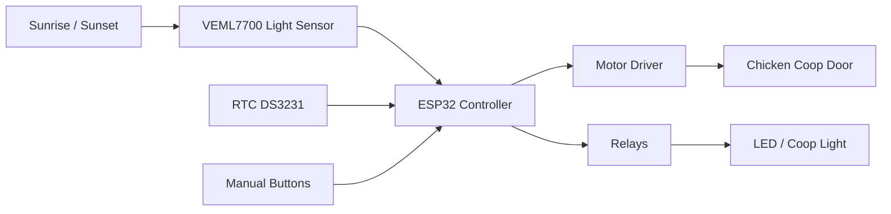
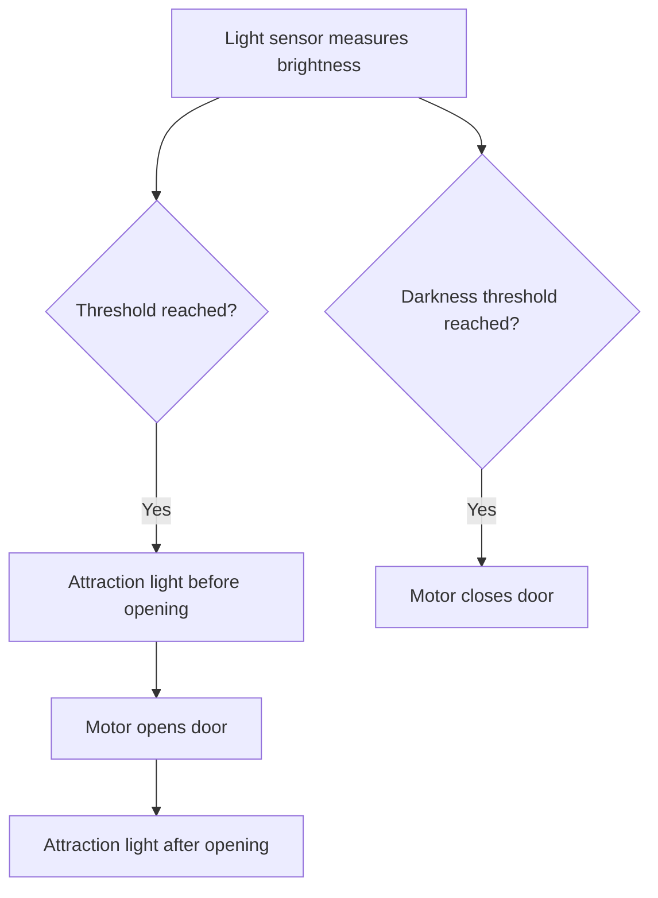
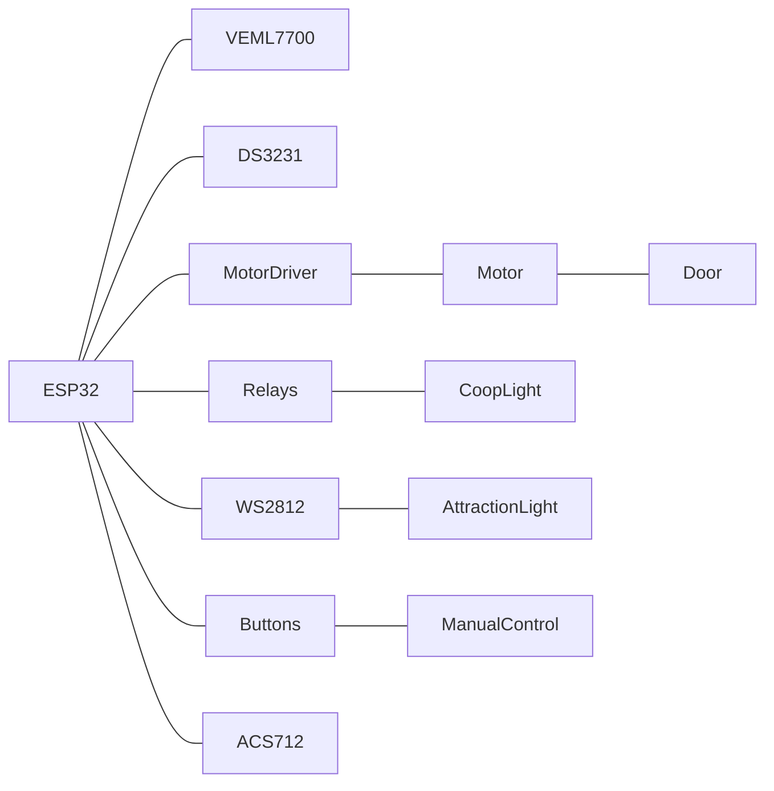

## ESP32 Chicken Coop Door Controller 🐔

Automatic chicken coop door controller using an **ESP32**, **light sensor**, **RTC**, **motor driver**, **attraction light**, and **web interface**.

The system automatically opens and closes the coop door depending on ambient light levels.

---

## 📷 System Overview



---

## 🧠 Operating Principle



---

## 🔌 Hardware Overview

## Main Components

| Component            | Description             |
| -------------------- | ----------------------- |
| ESP32 DevKit         | Main controller         |
| VEML7700             | Ambient light sensor    |
| DS3231               | Real-time clock         |
| L298N / Motor Driver | Motor controller        |
| ACS712               | Current sensor          |
| WS2812               | Attraction light LED    |
| Relay module         | Coop lighting           |
| Limit switches       | Door position detection |

---

## ⚡ Pin Mapping

| ESP32 Pin | Function               |
| --------- | ---------------------- |
| GPIO4     | WS2812 LED             |
| GPIO12    | Limit switch closed    |
| GPIO14    | Limit switch open      |
| GPIO18    | Attraction light relay |
| GPIO19    | Coop light relay       |
| GPIO21    | I²C SDA                |
| GPIO22    | I²C SCL                |
| GPIO25    | Motor IN1              |
| GPIO26    | Motor IN2              |
| GPIO27    | Motor PWM              |
| GPIO32    | Coop light button      |
| GPIO33    | Door control button    |
| GPIO34    | Current sensor         |

---

## 🔧 Wiring Diagram



---

## 🔌 I²C Bus

The I²C bus is shared by multiple components.

```
ESP32 GPIO21 (SDA) ───── VEML7700 SDA
                       └──── DS3231 SDA

ESP32 GPIO22 (SCL) ───── VEML7700 SCL
                       └──── DS3231 SCL
```

---

## 🚪 Limit Switches

Limit switches use **INPUT_PULLUP**.

Logic:

```
LOW  = switch active
HIGH = switch inactive
```

Wiring:

```
GPIO14 ─── Open limit switch ─── GND
GPIO12 ─── Closed limit switch ─── GND
```

---

## 🔘 Buttons

Door control:

```
GPIO33 ─── Button ─── GND
```

Coop light:

```
GPIO32 ─── Button ─── GND
```

---

## 💡 Attraction Light (WS2812)

```
GPIO4 ─── 330Ω ─── DIN WS2812
5V ─────────────── VCC
GND ────────────── GND
```

Recommended:

* 330Ω resistor in the data line
* 1000µF capacitor between 5V and GND

---

## ⚙️ Motor Control

Example using **L298N**

```
ESP32 GPIO25 → IN1
ESP32 GPIO26 → IN2
ESP32 GPIO27 → ENA

Motor → OUT1 / OUT2
12V → Motor power supply
```

---

## 🔒 Safety Features

The system includes several safety mechanisms:

* Limit switches stop the motor
* Current sensor detects blockages
* Timeout prevents continuous motor operation
* Manual control is always possible

---

## 🌐 Web Interface

The web interface allows configuration of:

* Opening threshold
* Closing threshold
* Attraction light duration
* Coop lighting
* Manual door control

---

## 📦 Project Structure

Recommended GitHub structure:

```
/firmware
/docs
/images
/hardware
README.md
```

---

## 📜 License

MIT License
