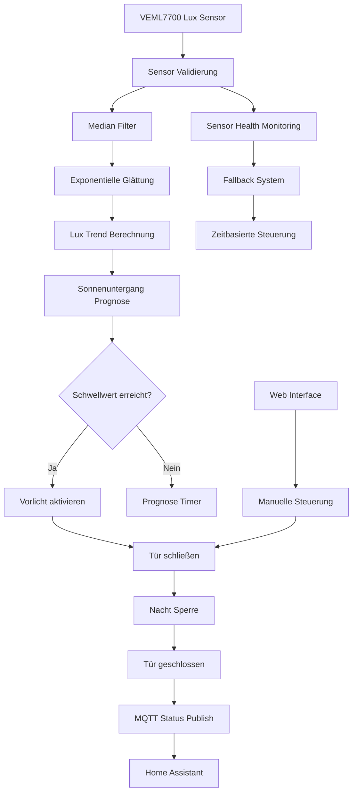

# 🧠 Firmware Architektur

Dieses Diagramm zeigt den grundlegenden Aufbau der Firmware des Chicken Coop Door Controllers.

---

# Firmware Komponenten

## Sensor Layer

* VEML7700 Lux Sensor
* automatische Gain Anpassung
* Sensor Health Monitoring
* I²C Bus Recovery

---

## Signal Processing

Verarbeitung der Rohdaten:

* Median Filter
* exponentielle Glättung
* Lux Trend Berechnung

---

## Decision Engine

Entscheidet über Öffnen oder Schließen:

* Lux Schwellenwerte
* Sonnenuntergang Prognose
* Wolken Erkennung

---

## Actuation Layer

Steuert die Hardware:

* Vorlicht
* Türmotor
* Endschalter

---

## Safety Layer

Sicherheitsfunktionen:

* Nacht Sperre
* Sensor Fallback
* Zeitbasierte Steuerung
* Endschalter Schutz

---

## Connectivity Layer

Kommunikation mit externen Systemen:

* MQTT
* Webinterface
* OTA Updates
