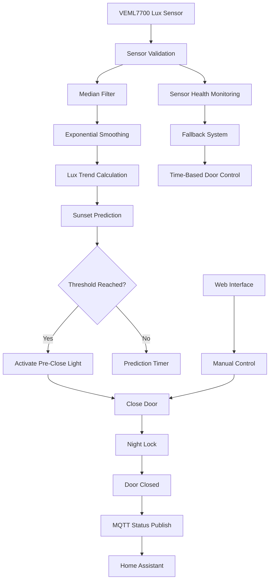

# 🧠 Firmware Architecture

This diagram shows the overall firmware architecture of the **Smart Chicken Coop Door Controller**.

The system processes ambient light measurements, predicts sunset conditions, and controls the coop door while ensuring safe operation through multiple fallback and safety mechanisms.

---

# System Architecture

---

# Firmware Components

## Sensor Layer

Responsible for acquiring and validating ambient light data.

Components include:

* VEML7700 ambient light sensor
* automatic gain adjustment
* sensor health monitoring
* I²C bus recovery

This layer ensures reliable sensor readings even under unstable conditions.

---

## Signal Processing

The raw sensor data is processed through multiple filtering stages to obtain stable measurements.

Processing steps include:

* median filtering
* exponential smoothing
* lux trend calculation

This helps reduce noise and prevents false triggers caused by temporary light spikes.

---

## Decision Engine

This layer determines when the door should open or close.

The logic includes:

* lux threshold detection
* sunset prediction using lux trend
* cloud detection and prediction cancellation

The prediction system allows the firmware to anticipate sunset instead of reacting too late.

---

## Actuation Layer

Controls the physical hardware of the system.

Components include:

* pre-close coop light
* door motor control
* limit switch monitoring

This layer ensures that the door operates safely and stops at the correct positions.

---

## Safety Layer

Multiple safety mechanisms protect the system and prevent incorrect behaviour.

Safety features include:

* night lock after closing
* sensor failure fallback
* time-based operation fallback
* limit switch protection

These mechanisms ensure safe operation even if sensors or communication fail.

---

## Connectivity Layer

Provides communication with external systems.

Supported interfaces include:

* MQTT integration
* web interface for configuration
* OTA firmware updates

This allows integration with smart home systems such as **Home Assistant** or **Node-RED**.

---

# Design Goals

The firmware was designed with the following goals in mind:

* reliable operation in real-world environments
* tolerance against sensor noise and clouds
* fail-safe behaviour in case of hardware issues
* easy integration into smart home systems

The combination of filtering, prediction, and fallback systems ensures **stable year-round operation**.
