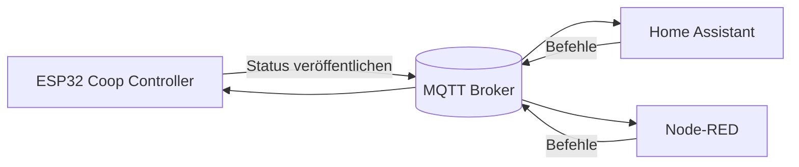

# 📡 MQTT Integration

Der **Smart Chicken Coop Door Controller** unterstützt MQTT zur Überwachung und Fernsteuerung.

Damit lässt sich das System einfach in Smart-Home Systeme integrieren, z.B.:

* Home Assistant
* Node-RED
* OpenHAB
* eigene Dashboards

---

# 📂 Basis Topic

Alle MQTT Topics verwenden folgendes Basis-Topic:

```
chickencoop/
```

Beispiel:

```
chickencoop/door/state
```

---

# 🌳 MQTT Topic Struktur

```
chickencoop
│
├── door
│   ├── state        → Türstatus
│   ├── action       → aktuelle Bewegung
│   ├── open         → Tür öffnen
│   └── close        → Tür schließen
│
├── light
│   ├── state        → Lichtstatus
│   ├── on           → Licht einschalten
│   └── off          → Licht ausschalten
│
├── sensor
│   ├── lux          → aktueller Lux-Messwert
│   └── status       → Sensorstatus
│
└── system
    ├── uptime       → Laufzeit des Controllers
    ├── wifi         → WLAN Signalstärke
    └── version      → Firmware Version
```

---

# 📊 MQTT Kommunikationsdiagramm



---

# 📥 Status Topics (vom Controller veröffentlicht)

Diese Topics werden **vom Controller veröffentlicht**.

| Topic                       | Beispiel          | Beschreibung           |
| --------------------------- | ----------------- | ---------------------- |
| `chickencoop/door/state`    | `open` / `closed` | aktueller Türstatus    |
| `chickencoop/door/action`   | `opening`         | aktuelle Bewegung      |
| `chickencoop/light/state`   | `on`              | Status des Stalllichts |
| `chickencoop/sensor/lux`    | `250`             | gemessener Lux-Wert    |
| `chickencoop/sensor/status` | `ok`              | Sensorstatus           |

---

# 📤 Command Topics (vom Controller abonniert)

Diese Topics werden **vom Controller abonniert**, um Befehle zu empfangen.

| Topic                    | Payload | Funktion          |
| ------------------------ | ------- | ----------------- |
| `chickencoop/door/open`  | `1`     | Tür öffnen        |
| `chickencoop/door/close` | `1`     | Tür schließen     |
| `chickencoop/light/on`   | `1`     | Licht einschalten |
| `chickencoop/light/off`  | `1`     | Licht ausschalten |

---

# 🧪 Beispiel MQTT Befehle

## Tür öffnen

Topic

```
chickencoop/door/open
```

Payload

```
1
```

---

## Tür schließen

Topic

```
chickencoop/door/close
```

Payload

```
1
```

---

# 🏠 Beispiel Home Assistant Integration

```yaml
switch:
  - platform: mqtt
    name: "Hühnerstall Tür"
    command_topic: "chickencoop/door/open"
    state_topic: "chickencoop/door/state"
```

---

# 📈 Optionale System Topics

Für Diagnose und Monitoring können zusätzliche Topics veröffentlicht werden.

| Topic                        | Beschreibung       |
| ---------------------------- | ------------------ |
| `chickencoop/system/uptime`  | Laufzeit des ESP32 |
| `chickencoop/system/wifi`    | WLAN Signalstärke  |
| `chickencoop/system/version` | Firmware Version   |
| `chickencoop/system/restart` | Neustart Grund     |

---

# 🧠 Empfehlungen für MQTT

| Einstellung | Empfehlung                   |
| ----------- | ---------------------------- |
| QoS         | 0 oder 1                     |
| Retain      | aktiviert für Status Topics  |
| Client ID   | eindeutige ID pro Controller |

---

# 📜 Hinweise

* Status Topics sollten **retain aktiviert haben**, damit Smart-Home Systeme den letzten Zustand kennen.
* Command Topics sollten **kein retain verwenden**, um unbeabsichtigte Wiederholungen zu vermeiden.
* Die Topic Struktur folgt üblichen IoT-Konventionen für bessere Integration.
