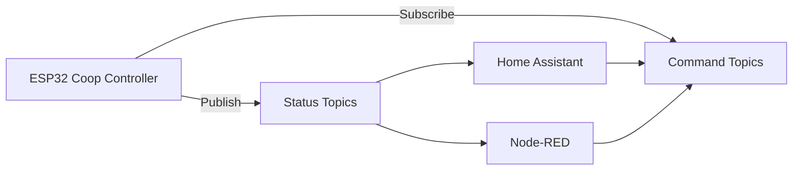

# 📡 MQTT Integration

The Smart Chicken Coop Door Controller supports MQTT for monitoring and remote control.

This allows easy integration with systems such as:

* Home Assistant
* Node-RED
* OpenHAB
* custom dashboards

---

# 📂 Base Topic

All MQTT topics use the following base topic:

```
chickencoop/
```

Example:

```
chickencoop/door/state
```

---

# 📊 MQTT Architecture



---

# 📥 Status Topics (Published)
