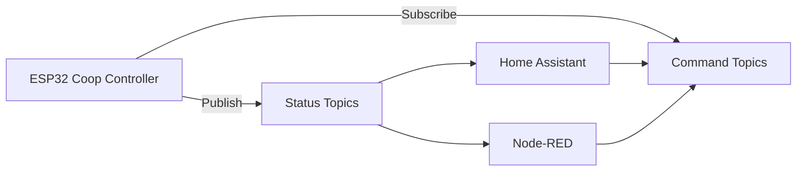

# 📡 MQTT Integration

The Smart Chicken Coop Door Controller supports MQTT for monitoring and remote control.

This allows easy integration with systems such as:

* Home Assistant
* Node-RED
* OpenHAB
* custom dashboards

---

# 📂 Base Topic

All MQTT topics use the following base topic:

```
chickencoop/
```

Example:

```
chickencoop/door/state
```

---

# 📊 MQTT Architecture



---

# 📥 Status Topics (Published)

These topics are **published by the controller**.

| Topic                       | Example Payload              | Description                 |
| --------------------------- | ---------------------------- | --------------------------- |
| `chickencoop/door/state`    | `open`, `closed`             | Current door state          |
| `chickencoop/door/action`   | `opening`, `closing`, `idle` | Current door movement       |
| `chickencoop/light/state`   | `on`, `off`                  | Coop light status           |
| `chickencoop/sensor/lux`    | `245`                        | Current ambient light value |
| `chickencoop/sensor/status` | `ok`, `error`                | Lux sensor status           |

---

# 📤 Command Topics (Subscribed)

These topics are **subscribed by the controller** and allow remote control.

| Topic                    | Payload | Function            |
| ------------------------ | ------- | ------------------- |
| `chickencoop/door/open`  | `1`     | Open the coop door  |
| `chickencoop/door/close` | `1`     | Close the coop door |
| `chickencoop/light/on`   | `1`     | Turn coop light on  |
| `chickencoop/light/off`  | `1`     | Turn coop light off |

---

# 🧪 Example MQTT Commands

## Open Door

Topic

```
chickencoop/door/open
```

Payload

```
1
```

---

## Close Door

Topic

```
chickencoop/door/close
```

Payload

```
1
```

---

# 📡 Example Status Messages

Example door status message:

Topic

```
chickencoop/door/state
```

Payload

```
closed
```

---

# 🏠 Home Assistant Example

Example MQTT switch configuration:

```yaml
switch:
  - platform: mqtt
    name: "Chicken Coop Door"
    command_topic: "chickencoop/door/open"
    state_topic: "chickencoop/door/state"
```

---

# 📈 Optional System Topics

Additional topics can be published for diagnostics.

| Topic                        | Description          |
| ---------------------------- | -------------------- |
| `chickencoop/system/uptime`  | ESP32 uptime         |
| `chickencoop/system/wifi`    | WiFi signal strength |
| `chickencoop/system/version` | Firmware version     |
| `chickencoop/system/restart` | restart reason       |

---

# 🧠 Best Practices

Recommended MQTT settings:

| Setting   | Recommendation           |
| --------- | ------------------------ |
| QoS       | 0 or 1                   |
| Retain    | enabled for state topics |
| Client ID | unique per controller    |

---

# 🔧 Example MQTT Configuration

Typical configuration parameters:

```
MQTT Broker: 192.168.1.10
Port: 1883
Client ID: coop-controller
Base Topic: chickencoop
```

---

# 📜 Notes

* Status topics should be **retained** to allow Home Assistant to detect the last state after reconnect.
* Commands should **not use retain** to avoid unintended repeated actions.
* Topic structure follows common IoT conventions for clarity and integration.
