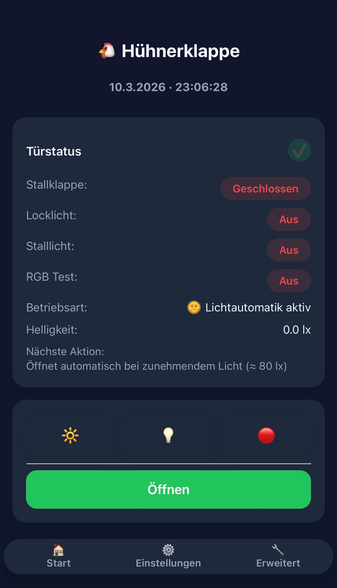
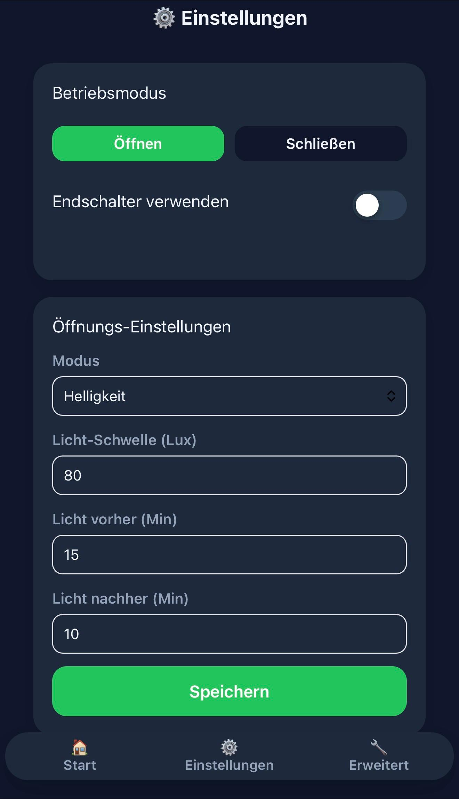
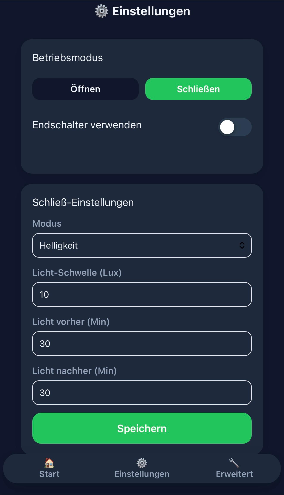
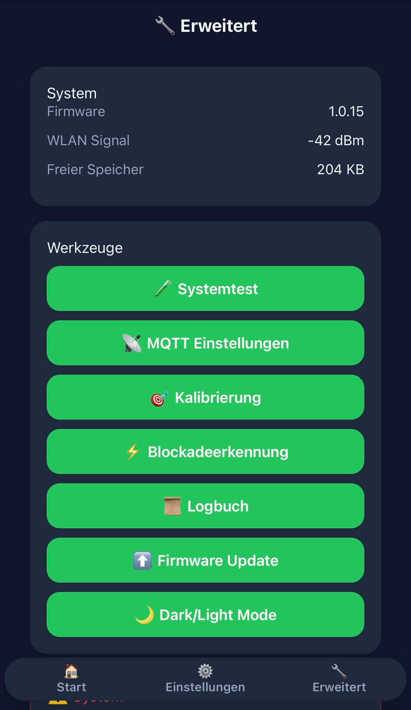
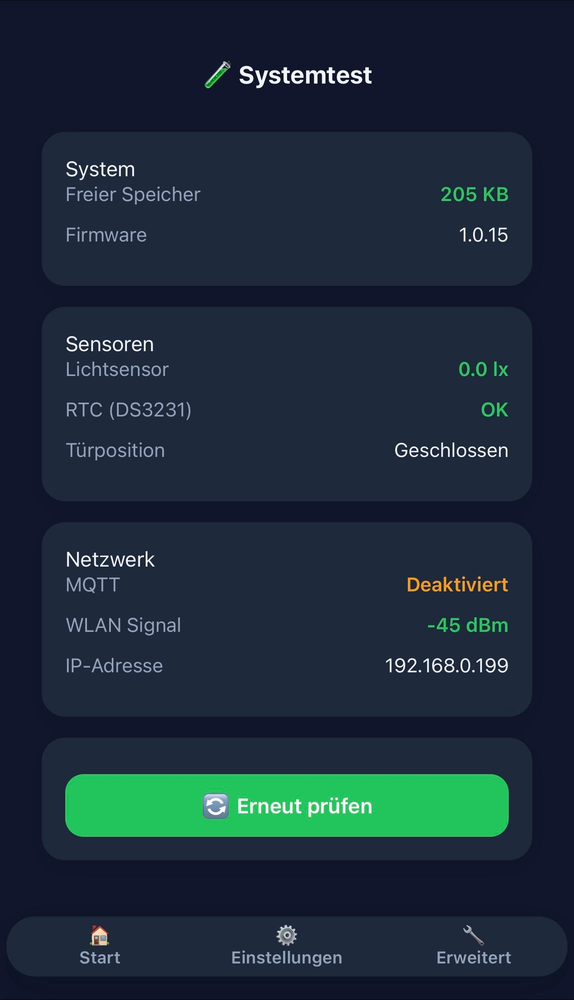
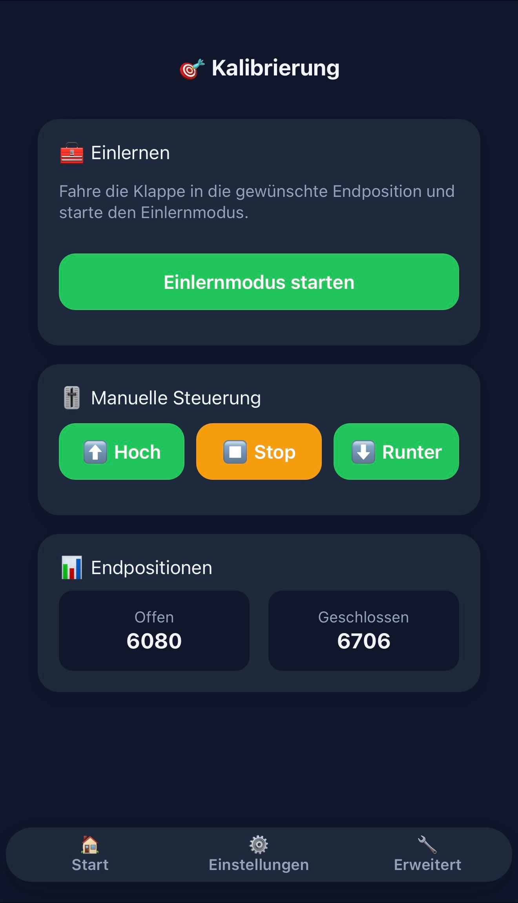
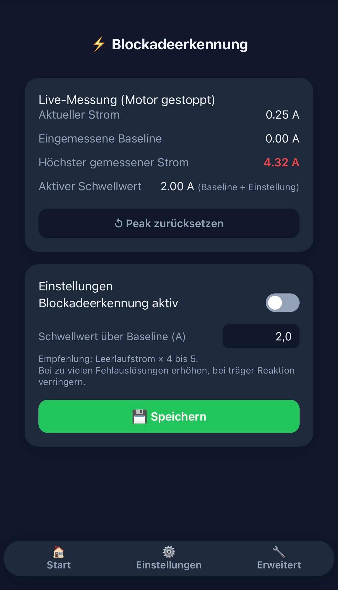
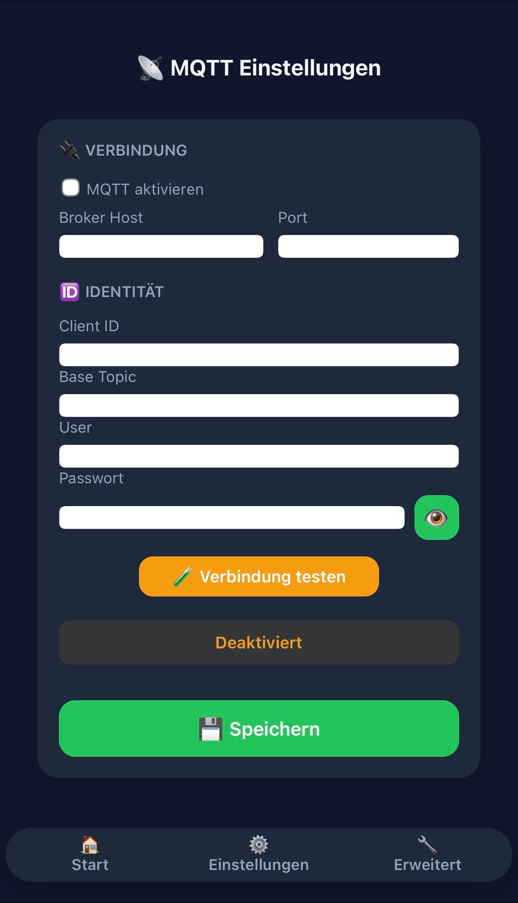
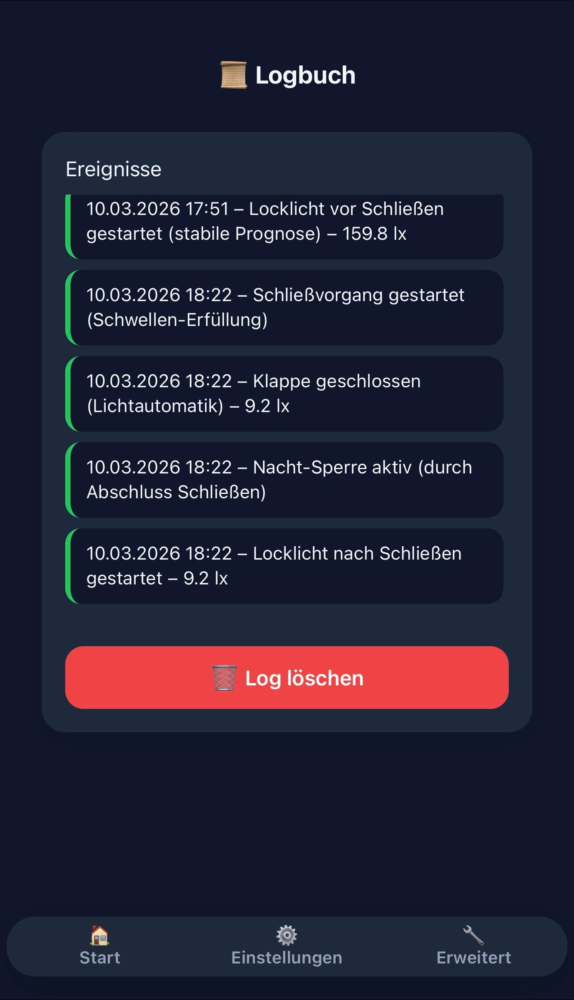
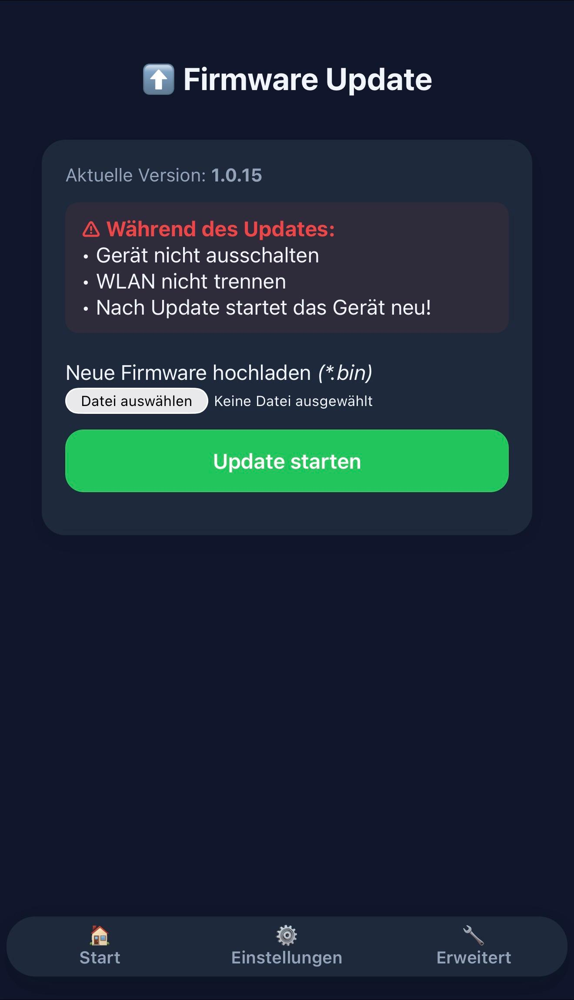

# 🌐 Web-Interface Dokumentation

🇬🇧 [English](webinterface.md) &nbsp;|&nbsp; 🇩🇪 Deutsch

Das Web-Interface ist über jeden Browser im Heimnetz erreichbar und kann als **PWA (Progressive Web App)** auf dem Smartphone installiert werden.

```
http://192.168.x.x
```

---

## Inhaltsverzeichnis

- [Startseite (Dashboard)](#-startseite-dashboard)
- [Einstellungen](#-einstellungen)
- [Erweitert](#-erweitert)
- [Systemtest](#-systemtest)
- [Kalibrierung](#-kalibrierung)
- [Blockadeerkennung](#-blockadeerkennung)
- [MQTT Einstellungen](#-mqtt-einstellungen)
- [Logbuch](#-logbuch)
- [Firmware Update](#-firmware-update)

---

## 🏠 Startseite (Dashboard)

> Navigationsleiste → **Start**

<p align="center">
  
</p>

Die Startseite zeigt den aktuellen Systemstatus auf einen Blick und ermöglicht die manuelle Steuerung aller Funktionen.

### Statusanzeige

| Feld | Beschreibung |
|---|---|
| **Datum / Uhrzeit** | Aktuelle Zeit laut RTC DS3231 |
| **Stallklappe** | `Offen` (grün) oder `Geschlossen` (rot) |
| **Locklicht** | Aktueller Zustand des Locklichts |
| **Stalllicht** | Aktueller Zustand des Stalllichts |
| **RGB Test** | Zustand des RGB-Rotlichts |
| **Betriebsart** | Aktiver Modus, z. B. `🌞 Lichtautomatik aktiv` |
| **Helligkeit** | Aktueller Lux-Wert des VEML7700-Sensors |
| **Nächste Aktion** | Vorschau der nächsten automatischen Aktion |

> Das grüne Häkchen oben rechts in der Türstatus-Karte zeigt den Systemgesundheitsstatus. Ein Klick führt direkt zum Systemtest.

### Schnellsteuerung (Lichtbuttons)

| Symbol | Funktion |
|---|---|
| 🔆 | Locklicht ein/aus |
| 💡 | Stalllicht ein/aus |
| 🔴 | RGB-Rotlicht ein/aus |

### Türsteuerung

Der große Button unten wechselt je nach aktuellem Zustand:

| Zustand | Button | Farbe |
|---|---|---|
| Tür geschlossen | **Öffnen** | Grün |
| Tür offen | **Schließen** | Rot |
| Motor läuft | **Stopp** | Orange |

---

## ⚙️ Einstellungen

> Navigationsleiste → **Einstellungen**

<p align="center">
  
  
</p>
<p align="center"><em>Links: Öffnungs-Einstellungen &nbsp;|&nbsp; Rechts: Schließ-Einstellungen</em></p>

Konfiguration der Öffnungs- und Schließautomatik. Die Seite ist in zwei Bereiche aufgeteilt, umschaltbar über **Öffnen** / **Schließen**.

### Betriebsmodus

| Option | Beschreibung |
|---|---|
| **Öffnen** | Einstellungen für den Öffnungsvorgang |
| **Schließen** | Einstellungen für den Schließvorgang |
| **Endschalter verwenden** | Toggle: Hardware-Endschalter aktivieren/deaktivieren |

### Öffnungs-Einstellungen

| Feld | Beispielwert | Beschreibung |
|---|---|---|
| **Modus** | `Helligkeit` | Automatik per Lux-Sensor oder `Zeit` für feste Uhrzeit |
| **Licht-Schwelle (Lux)** | `80` | Ab diesem Lux-Wert öffnet die Tür automatisch |
| **Licht vorher (Min)** | `15` | Locklicht schaltet X Minuten **vor** dem Öffnen ein |
| **Licht nachher (Min)** | `10` | Locklicht bleibt X Minuten **nach** dem Öffnen an |

### Schließ-Einstellungen

| Feld | Beispielwert | Beschreibung |
|---|---|---|
| **Modus** | `Helligkeit` | Automatik per Lux-Sensor oder `Zeit` |
| **Licht-Schwelle (Lux)** | `10` | Unter diesem Lux-Wert schließt die Tür automatisch |
| **Licht vorher (Min)** | `30` | Stalllicht schaltet X Minuten **vor** dem Schließen ein |
| **Licht nachher (Min)** | `30` | Stalllicht bleibt X Minuten **nach** dem Schließen an |

> 💡 **Empfohlene Richtwerte:**
> - Öffnen-Schwelle: 50–200 lx (je nach Standort und Jahreszeit)
> - Schließen-Schwelle: 5–20 lx
> - Die Öffnen-Schwelle muss immer **größer** sein als die Schließen-Schwelle

Nach Änderungen auf **Speichern** klicken – Werte werden dauerhaft im EEPROM gespeichert.

---

## 🔧 Erweitert

> Navigationsleiste → **Erweitert**

<p align="center">
  
</p>

Systemübersicht und Zugang zu allen Werkzeugen.

### Systeminfo

| Feld | Beschreibung |
|---|---|
| **Firmware** | Installierte Firmware-Version (z. B. `1.0.15`) |
| **WLAN Signal** | Signalstärke in dBm (gut: besser als −70 dBm) |
| **Freier Speicher** | Verfügbarer Heap-Speicher des ESP32 |

### Werkzeuge

| Button | Ziel | Beschreibung |
|---|---|---|
| 🔬 **Systemtest** | `/systemtest` | Hardware-Selbsttest aller Komponenten |
| 📡 **MQTT Einstellungen** | `/mqtt` | MQTT-Broker konfigurieren |
| 🎯 **Kalibrierung** | `/calibration` | Motorpositionen einlernen |
| ⚡ **Blockadeerkennung** | `/calibration` | ACS712 Stromsensor konfigurieren |
| 📋 **Logbuch** | `/log` | Ereignisprotokoll anzeigen |
| ⬆️ **Firmware Update** | `/fw` | OTA-Update einspielen |
| 🌙 **Dark/Light Mode** | – | Anzeigemodus umschalten |

---

## 🔬 Systemtest

> Erweitert → **Systemtest** oder direkt `/systemtest`

<p align="center">
  
</p>

Führt einen vollständigen Hardware-Selbsttest durch und zeigt den Status aller Komponenten.

### System

| Feld | Beschreibung |
|---|---|
| **Freier Speicher** | Heap in KB, grün = ausreichend (> 100 KB) |
| **Firmware** | Aktuell installierte Version |

### Sensoren

| Feld | Erwarteter Wert | Beschreibung |
|---|---|---|
| **Lichtsensor** | Lux-Wert in grün | VEML7700 erreichbar und liefert Messwerte |
| **RTC (DS3231)** | `OK` in grün | Echtzeituhr korrekt erkannt |
| **Türposition** | `Offen` oder `Geschlossen` | Aktuell gespeicherter Türzustand |

### Netzwerk

| Feld | Beschreibung |
|---|---|
| **MQTT** | `Verbunden` (grün) oder `Deaktiviert` / `Fehler` (orange/rot) |
| **WLAN Signal** | Signalstärke in dBm |
| **IP-Adresse** | Aktuelle IP des ESP32 im Heimnetz |

> Mit **Erneut prüfen** wird der Test wiederholt ohne die Seite neu zu laden.

---

## 🎯 Kalibrierung

> Erweitert → **Kalibrierung** oder direkt `/calibration`

<p align="center">
  
</p>

Beim ersten Aufbau müssen die Motorlaufzeiten eingelernt werden. Die gespeicherten Werte zeigen die Laufzeit in Millisekunden bis zur jeweiligen Endposition.

### Endpositionen

| Position | Beispielwert | Beschreibung |
|---|---|---|
| **Offen** | `6080` | Motorlaufzeit in ms bis Tür vollständig offen |
| **Geschlossen** | `6706` | Motorlaufzeit in ms bis Tür vollständig geschlossen |

### Einlernen

1. Auf **Einlernmodus starten** klicken
2. Motor fährt die Tür auf – bei Endposition bestätigen
3. Motor fährt die Tür zu – bei Endposition bestätigen
4. Werte werden automatisch im EEPROM gespeichert

### Manuelle Steuerung

Für manuelle Tests oder Nachjustierung:

| Button | Funktion |
|---|---|
| ⬆️ **Hoch** | Motor fährt Richtung offen |
| ⏹ **Stop** | Motor sofort stoppen |
| ⬇️ **Runter** | Motor fährt Richtung geschlossen |

> ⚠️ Die manuelle Steuerung ignoriert Endschalter und Timeouts – Motor rechtzeitig manuell stoppen!

---

## ⚡ Blockadeerkennung

> Erweitert → **Blockadeerkennung**

<p align="center">
  
</p>

Konfiguration des ACS712-Stromsensors zur automatischen Erkennung von Motorblockaden (z. B. eingeklemmtes Hindernis).

### Live-Messung

| Feld | Beschreibung |
|---|---|
| **Aktueller Strom** | Gemessener Motorstrom in Ampere (Echtzeit) |
| **Eingemessene Baseline** | Leerlaufstrom des Motors (wird automatisch kalibriert) |
| **Höchster gemessener Strom** | Peak-Wert seit letztem Reset (rot = erhöhter Wert) |
| **Aktiver Schwellwert** | Baseline + Einstellung = Auslöseschwelle |

> Mit **Peak zurücksetzen** wird der gespeicherte Höchstwert gelöscht.

### Einstellungen

| Feld | Empfehlung | Beschreibung |
|---|---|---|
| **Blockadeerkennung aktiv** | Toggle an | Erkennung aktivieren/deaktivieren |
| **Schwellwert über Baseline (A)** | Leerlaufstrom × 4–5 | Auslöseschwelle oberhalb des Leerlaufstroms |

> 💡 **Einstellhilfe:**
> - Zu viele Fehlauslösungen → Schwellwert erhöhen
> - Träge Reaktion bei echten Blockaden → Schwellwert verringern
> - Typischer Ausgangswert: `2,0 A`

---

## 📡 MQTT Einstellungen

> Erweitert → **MQTT Einstellungen** oder direkt `/mqtt`

<p align="center">
  
</p>

Verbindung zu einem MQTT-Broker für Smart-Home-Integration (Home Assistant, Node-RED etc.).

### Verbindung

| Feld | Beispiel | Beschreibung |
|---|---|---|
| **MQTT aktivieren** | Checkbox | MQTT-Client ein-/ausschalten |
| **Broker Host** | `192.168.1.100` | IP oder Hostname des MQTT-Brokers |
| **Port** | `1883` | Standard MQTT-Port |

### Identität

| Feld | Beispiel | Beschreibung |
|---|---|---|
| **Client ID** | `huehnerklappe` | Eindeutiger Gerätename am Broker |
| **Base Topic** | `huehnerklappe` | Präfix für alle Topics |
| **User** | `mqtt_user` | Benutzername (optional) |
| **Passwort** | `••••••••` | Passwort (optional, mit Augensymbol anzeigbar) |

Mit **Verbindung testen** (orange) wird die Verbindung geprüft ohne zu speichern.  
Mit **Speichern** (grün) werden die Einstellungen dauerhaft gespeichert.

> Vollständige Topic-Übersicht und Home-Assistant-Konfiguration: [mqtt.de.md](mqtt.de.md)

---

## 📋 Logbuch

> Erweitert → **Logbuch** oder direkt `/log`

<p align="center">
  
</p>

Zeigt die letzten Systemereignisse mit Zeitstempel. Der Ringpuffer speichert die letzten Einträge dauerhaft im EEPROM – auch nach einem Neustart verfügbar.

### Beispiel-Einträge

```
10.03.2026 17:51 – Locklicht vor Schließen gestartet (stabile Prognose) – 159.8 lx
10.03.2026 18:22 – Schließvorgang gestartet (Schwellen-Erfüllung)
10.03.2026 18:22 – Klappe geschlossen (Lichtautomatik) – 9.2 lx
10.03.2026 18:22 – Nacht-Sperre aktiv (durch Abschluss Schließen)
10.03.2026 18:22 – Locklicht nach Schließen gestartet – 9.2 lx
```

> Mit **Log löschen** (rot) werden alle Einträge unwiderruflich gelöscht.

### Typische Ereignistypen

| Ereignis | Bedeutung |
|---|---|
| `Locklicht vor Schließen gestartet` | Vorlicht hat begonnen – Prognose ist stabil |
| `Schließvorgang gestartet (Schwellen-Erfüllung)` | Lux-Wert hat die Schließschwelle unterschritten |
| `Klappe geschlossen (Lichtautomatik)` | Tür erfolgreich geschlossen, aktueller Lux-Wert |
| `Nacht-Sperre aktiv` | Verhindert versehentliches Öffnen bis zum Morgen |
| `Klappe geöffnet (Lichtautomatik)` | Tür automatisch geöffnet |
| `MQTT verbunden` | Verbindung zum Broker hergestellt |
| `Sensor-Node: xx.x°C, xx.x%` | Empfangene Daten vom BME280 Sensor-Node |

---

## ⬆️ Firmware Update

> Erweitert → **Firmware Update** oder direkt `/fw`

<p align="center">
  
</p>

Aktualisierung der Firmware kabellos über den Browser (OTA – Over The Air).

### Vorgehen

1. Neue Firmware in PlatformIO bauen: **PlatformIO → Build**
2. Datei liegt unter `.pio/build/esp32dev/firmware.bin`
3. Im Web-Interface auf **Datei auswählen** klicken → `firmware.bin` wählen
4. Auf **Update starten** klicken
5. Warten bis das Gerät neu startet (ca. 30–60 Sekunden)

### Hinweise während des Updates

> ⚠️ **Gerät nicht ausschalten**  
> ⚠️ **WLAN nicht trennen**  
> ⚠️ Nach dem Update startet das Gerät automatisch neu

Das System sichert sich vor dem Update selbst ab:
- Motor wird sofort gestoppt
- Alle Ausgänge werden abgeschaltet
- WebServer bleibt aktiv für den Upload

---

## 📱 Als PWA installieren

Das Web-Interface kann als App auf dem Smartphone installiert werden:

**iOS (Safari):**  
Teilen-Symbol → „Zum Home-Bildschirm"

**Android (Chrome):**  
Menü → „App installieren" oder „Zum Startbildschirm hinzufügen"

Nach der Installation erscheint die Hühnerklappe als eigenständige App mit eigenem Icon – ohne Browser-Adressleiste.
